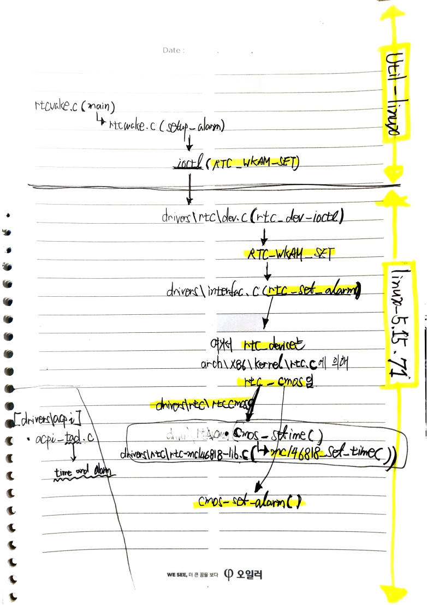

# From rtcwake(util-linux) to Linux Kernel(5.15.71)
> ◈ References
>
>  - [util-linux](https://github.com/util-linux/util-linux)
>  - [Linux Kernel 5.15.71](https://cdn.kernel.org/pub/linux/kernel/v5.x/linux-5.15.71.tar.xz)

