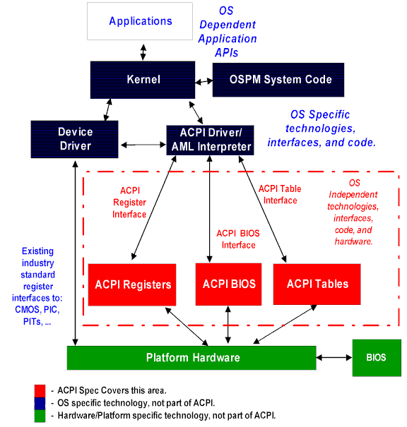

# ACPI에 대해

> ◈ References
>
>  - [KBENCH](https://kbench.com/?q=node/696)

## ACPI란?

- ACPI는 Advanced Configuration and Power Interface의 약자로 인텔, 마이크로소프트, 도시바에 의해 개발되었다. 이것은 소프트웨어와 하드웨어 구성 요소가 OS, 마더보드, 주변장치(CD-ROM, 하드디스크 등등)의 각각의 전력 사용에 대해 어떻게 대처하는지에 대해 명확히 하고 있다.
- ACPI의 목적은 전력 관리와 플러그 앤 플레이를 OS 안에 내장하는 것으로 오직 필요한 만큼만 주변장치에 전력이 공급되도록 한다.

 

## ACPI의 의의

- OS에 독립적
- 마더보드 주변장치를 제어하는 것을 OS에 할당
- 포터블, 데스크탑, 서버에 적용할 수 있는 유연성 있는 기술
- Non-ACPI OS의 구형 전력 관리 지원
- 비용 절감 효과

## 일반적인 ACPI 용어

- AML : ACPI control method Machine Language
  - ACPI가 호환되는 운영체제에 의해 지원되는 가상 머신을 위한 의사코드(pseudocode)
- ASL : ACPI contorl method Source Language
  - AML에 대응하는 프로그램 언어. ASL은 AML 이미지로 컴파일 된다.
- OSPM : OS-Directed Power Management
  - 전력 관리 모델로서 OS는 중앙 규칙(Central role)과 광역 정보(Global information)를 사용하여 가까운 장래에 일어날 작업을 위해 시스템을 최적화한다.
- P-Code : P-Code는 간단한 가상 머신 언어의 한 종류로서 ACPI가 제어 방법을 기술하기 위해 사용한다. 이것의 주요한 잇점은 포터블하고 컴팩트하며 강력하다는 것이다. 많은 종류의 P-Code가 있으며 ACPI는 이것을 그 자신의 것으로 정의한다. ACPI 사양서에는 ACPI Source Language(ASL)과 ACPI Machine Language(AML)이 정의되어 있으며 제어 방법은 ASL에 쓰여 있다. 이것은 상대적으로 간단한 사양서이다. 컴파일러는 P-Code의 ASL 폼을 AML 폼으로 바꾸어준다. ACPI 호환 운영체제는 AML 폼의 언어를 위해 P-Code 인터프리터를 포함하고 있다.
- SCI : System Control Interrupt
  - 하드웨어에 의해 사용되는 시스템 인터럽트는 ACPI 이벤트를 O/S에 통지한다. SCI는 low, shareable, level interrupt의 상태를 가질 수 있다.
- SMI : System Management Interrupt
  - 구형 시스템상의 인터럽트 이벤트에 의해 OS-transparent 인터럽트가 발생한다. ACPI 시스템상에서 대조에 의해 인터럽트 이벤트가 OS-visible 인터럽트를 발생하며 이것은 공유 가능하다.(edge-style 인터럽트는 동작하지 않는다) 하드웨어 플랫폼은 구형의 운영체제 시스템과 ACPI 시스템을 지원하기를 원한다면, ACPI와 구형 모델간에 스위칭될 때 SMI와 SCI 사이의 인터럽트 이벤트를 재매핑해야 한다. 

## ACPI의 구조

- ACPI에는 세 개의 런타임이 있으며 다음과 같다.
  - **ACPI Tables**
    - 이 테이블들은 하드웨어의 인터페이스를 기술하고 어떤 데스크립션은 만들어지는 것이 제한된다. (어떤 컨트롤은 레지스터의 고정 블록에 끼어있으며 이 테이블은 레지스터 블록의 어드레스를 명기한다.)

    - 대부분의 데스크립션은 하드웨어에서 정해지지 않은 방법으로 만들어지는 것이 허가되며, 하드웨어 평션을 만드는 것을 필요로하는 정해지지 않은 순차적인 동작을 할 수 있다. ACPI 테이블은 P-code 형태의 언어를 사용하여 만들어지고, 그 해석은 O/S에 의해 이루어진다. 이것은 O/S가 AML 인터프리터를 포함하며 이를 사용하여 AM에서 인코딩 프로시져를 수행하고 ACPI 테이블에 저장한다. ACPI Machine Language(AML)은 머신 언어의 한 종류로서 컴팩트하고 추상적이다.

  - **ACPI Register**
    - 하드웨어 인터페이스의 이 부분은 ACPI 테이블에 의해 기술된다.

  - **ACPI BIOS**
    - 펌웨어의 일부를 참고하면 이것은 ACPI 사양서와 호환된다. 일반적으로 이것은 머신을 부팅시키는 코드이며 슬립, 웨이크, 재기동 등을 위한 도구라고 할 수 있다. ACPI 데스크립션 테이블은 ACPI BIOS에 의해 제공된다. 위의 그림을 살펴보면 BIOS 와 ACPI BIOS가 플랫폼상의 같은 부분을 참조하는 것을 알 수 있다. 

## ACPI의 동작

- ACPI에서 OS 독립성을 얻기 위해서는 하드웨어 세부 사양을 자세히 해석하는 조정자에 의해 동작하는 OS와 하드웨어간의 추상적인 인터페이스를 만들어야 한다. 이런 추상적인 인터페이스는 위의 그림과 같다. 
- ACPI 사양서는 전체 PC 시스템을 위해 4개의 글로벌 상태를 정의하는데 각각 **Working, Sleeping, Soft-off, Mechanical-off**이다. ACPI 호환 OS는 주로 스왑매니저(swap manager)로서 동작하며, 수집된 정보를 기초로하여 서로 다른 상태로 바꾸게 된다. 한 상태에서 다른 상태로의 전환은 명확한 상태 전환을 위해 OS 커널에게 지시하는 OSPM 시스템 코드와 함께 시작된다. 커널이 명령을 받은후에 이 동작을 수행하기 위해 디바이스 드라이버를 전용(독점적인 사용)할 것인지를 묻게 된다. 이 동작으로부터 응답이 커널로부터 OSPM으로 간다. 이 진행 과정은 모든 디바이스와 컴퍼넌트가 명확한 상태에 도달할때까지 계층적인 순서에 의해서 진행된다.

