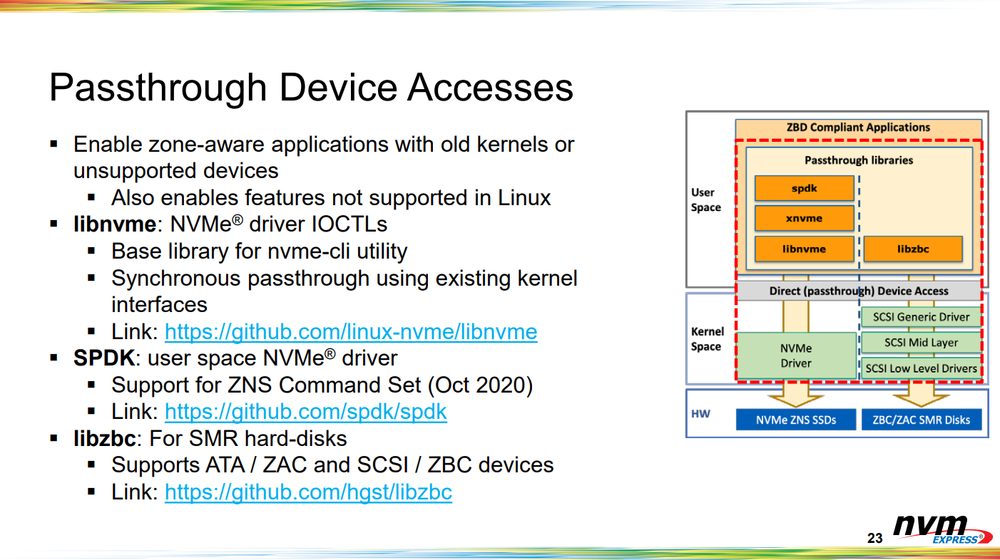

# Passthrough Device Accesses

> ◈ References
>
>  - [NVMe® Zoned Namespace SSDs & The Zoned Storage Linux® Software Ecosystem](https://nvmexpress.org/wp-content/uploads/September-2020_NVMe-Zoned-Namespace-SSDs-The-Zoned-Storage-Linux-Software-Ecosystem.pdf)

## Linux Kernel에서 SSD를 Direct Access하는 방식

