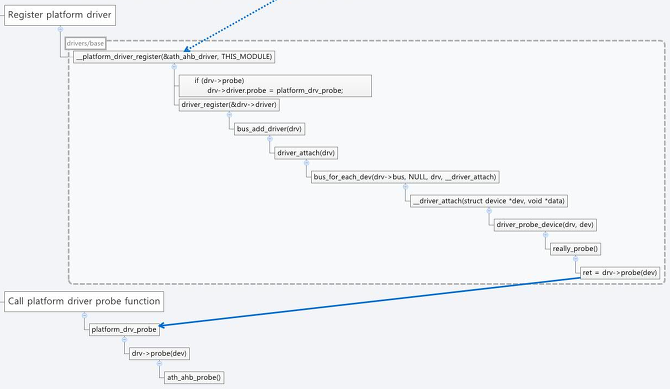

# [Kernel 4.2] Device driver - platform_driver probe 함수 호출 과정
> ◈ References
>
>  - [꿈꾸는 사람](https://dreamlog.tistory.com/449)

platform_driver의 probe 함수가 호출되는 과정을 알아보자.

## 1. start_kernel()에서 드라이버 초기화 진입 과정.

디바이스 드라이버 호출 과정은 [이전 글](2022/12/2022-12-28-linux_initcall.md)을 참고하라. 이전 글에 보충할 부분은 다음과 같다.

kernel_thread()가 kernel_init()를 생성하는데 kernel_init()는 /proc/1 프로세스에 해당한다.

init/main.c 파일의 do_one_initcall() 함수에서 fn()를 호출하는데 이 함수는 autheros의 module_init()에 등록된 함수이다.

빌드 후 System.map 파일에서 __initcall_ath9k_init6로 찾을 수 있다.

이것은 ath9k_init()에 해당한다.

ath9k_init()는 platform_driver인 ath_ahb_driver를 platform_driver_register()로 등록한다.

platform_driver_register()는 위 그림처럼 platform_driver ath_ahb_driver의 probe함수를 호출하게 된다.

즉, ath_ahb_probe()는 커널 부팅 후 초기화 과정 중 위와 같이 호출되어 Atheros wifi driver를 초기화 한다.

전체 과정은 다음과 같다.

