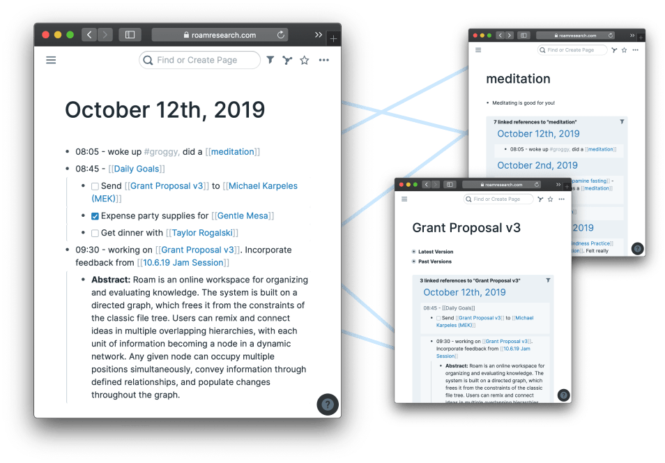

# 2023-01

### Linux

- [Ubuntu Releases Schedule](https://wiki.ubuntu.com/Releases)
- [Ubuntu Releases Download](https://releases.ubuntu.com/)

### PKM(Personal Knowledge Management)

> 개발 회사가 종종 사라지면서, 데이터 고아가 되는 경우가 종종 발생한다. 문제는 데이터를 백업받더라도, 그걸 다른 툴로 마이그레이션 하는 건 또 별개의 이야기라는 거. 그 덕에 아예 데이터를 내가 가져야겠다는 욕망을 가지게 되는 사람들이 꽤 된다.
>

> `나 역시 그 일부.`
>
> 그래서 현재 선택한 방법이 마크다운 파일 기반으로 정리하고 Github를 통해 관리하고 있다. 툴이 사라지더라도 데이터는 여전히 내 컴퓨터에 보관되어 있고 마크다운을 지원하는 툴도 많으니.
>

> `한계가 너무 느껴졌다.`
>
> 기존의 Note-taking은 Top-bottom 방식으로 미리 카테고리를 만들고 그 안에서 주제를 선정하고 그 주제를 뒷받침할 근거를 찾아 노트를 작성했다. 구조를 생각하고 그에 맞게 파일을 넣었는데.. 알고 보니 구조에 맞지 않을때가 많았고 그러다보니 점점 나의 노트는 더 이상 미래에 사용하기 어려워졌다. 그 문제를 해결하기 위해 Bottom-up 방식으로 노트를 만들고 싶었고 그러기 위해 찾은 방법론이 [제텔카스텐](https://www.zklab.kr/)이다. 

- [제텔카스텐](2023/01/2023-01-15-zettel_kasten.md)
  - Zettel(종이쪽지) + Kasten(상자)라는 뜻으로, 종이쪽지를 넣는 상자라는 의미로, 메모를 잘 분류하여 종이상자에 넣는 것이다.

- Articles

  - [최고의 노트앱 리스트 정리 - 지식을 다루는 도구](https://tilnote.io/pages/63b3a01aa3dfe0cae3301210?utm_source=pocket_saves)
  - [내가 사랑한 PKM툴 8종](https://brunch.co.kr/@labica/23)
  - [제텔카스텐과 지식관리 앱](https://m.clien.net/service/board/park/16255090)
- Application
  - [OBSIDIAN](https://obsidian.md/)
    - [옵시디안 - 마크다운 기반의 지식 베이스 노트앱](https://tilnote.io/pages/63a3c95dadf3223383d8d5e5)
    - [옵시디안 캔버스 사용하기 - 생각을 위한 비주얼 공간](https://tilnote.io/pages/63b6a70deb6139cc05884554)
    - [사람이 생각하는 법을 닮은 툴 - Roam Research와 Obsidian](https://luran.me/422)
    - [PC / 모바일에서 obsidian 동시 사용하기](https://luran.me/427)
    - [Obsidian 사용하기에 앞서](https://velog.io/@sharphand1/Obsidian-하나만-이해해도-실력이)
    - [Obsidian 2개월 사용 후기 및 개선 방향 정하기 1일차](https://velog.io/@sharphand1/Obsidian-2개월-사용-후기-및-개선-방향-정하기-1일차)
    - [Obsidian 제대로 사용하기 프로젝트 2일차(LYT framework , zettel)](https://velog.io/@sharphand1/Obsidian-제대로-사용하기-프로젝트-2일차)
    - [Obsidian 제대로 사용하기 프로젝트 3일차(HOW TO zettel-kasten)](https://velog.io/@sharphand1/Obsidian-제대로-사용하기-프로젝트-3일차HOW-TO-zettel-kasten)
    - [Obsidian 제대로 사용하기 프로젝트 4일차](https://velog.io/@sharphand1/Obsidian-제대로-사용하기-프로젝트-4일차)
    - [Obsidian 제대로 사용하기 프로젝트 결과 발표](https://velog.io/@sharphand1/Obsidian-제대로-사용하기-프로젝트-마지막날)
    - [옵시디언 무료 퍼블리싱 방법과 사용법](https://velog.io/@sharphand1/옵시디언-무료-퍼블리싱-하는-방법)
    - [heatmap-calendar-obsidian 사용 후기](https://velog.io/@sharphand1/heatmap-calendar-obsidian-사용-후기)
  
  - [Logseq](https://github.com/logseq/logseq)
    - [logseq - Roam Research의 훌륭한 대체제](https://luran.me/424)
    - [logseq + obsidian 함께 사용하기](https://luran.me/425)
    - [logseq + zotero 연동](https://luran.me/430)
    - [logseq template 사용하기](https://luran.me/437)
    - [logseq와 obsidian에서 호환되는 마크다운 문법](https://luran.me/472)
    - [macOS에서 작성한 Logseq 내용이 Windows 환경에서 보이지 않을 때 (한글자소분리 이슈)](https://zellyshu.github.io/posts/2021-11-12-logseq-hanguljaso/)
  
  
  
