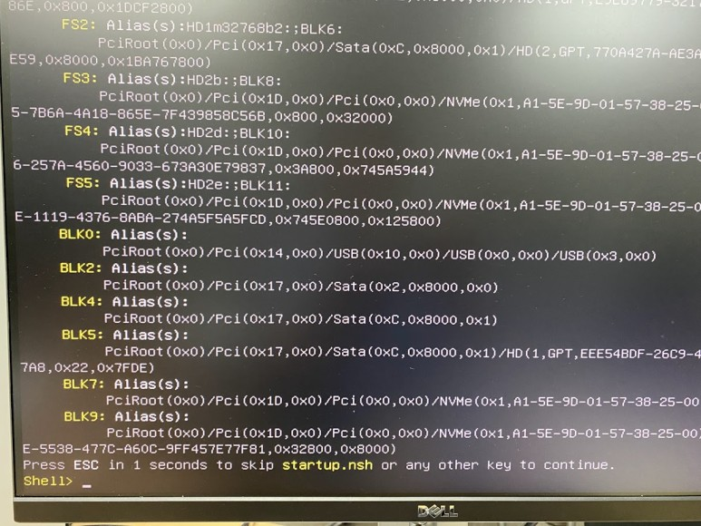

# UEFI 쉘를 DOS 처럼 사용하기 1부

> ◈ References
>
>  -  [UEFI 쉘를 DOS 처럼 사용하기 1부](https://blog.naver.com/deelab24/222793940769)
> 
> 

이 글은 UEFI에 대한 개략적인 소개 (1부)와

UEFI Shell의 소개(2부)를 다룰 예정입니다.

EFI는 인텔이 아이테엄 프로세서를 개발하면서 새로 설계한 기존(Legacy)의 BIOS를 대체하는 Firmware였습니다.

2005년 발족한 UEFI Forum에 공개하여 UEFI로 이름이 변경되었고, 2006년 UEFI 2.0 스팩이 공개됩니다.

당시 발표된 MS의 Windows Vista와 함께 본격화 되었습니다.

(Legacy) BIOS(Basic Input Output System)는 CP/M을 개발한 게리 킬달(Gary Kildall)의 위대한 유산이지만...

너무 오래 되었죠.

또 느리고, BIOS의 역할이 너무 작습니다.

[https://namu.wiki/w/%EA%B2%8C%EB%A6%AC%20%ED%82%AC%EB%8B%AC](https://namu.wiki/w/게리 킬달)

[https://namu.wiki/w/%EB%B0%94%EC%9D%B4%EC%98%A4%EC%8A%A4](https://namu.wiki/w/바이오스)

이제 보내줘야 할 때가 된 것 같습니다.

용어에 대한 부분인데요.

BIOS는 때로는 Legacy BIOS에 한정하여,

또 때로는 BIOS와 UEFI 펌웨어까지를 통칭하는 용어로 계속 쓰일 것 같습니다.

문맥에 맞게 해석해 주세요.

**UEFI의 역사**

UEFI의 역사

대충 훝어 보시면, 많은 업체들이 참여하고 있고, UEFI가 대충 정착될 때도 되었구나 이런 생각이 드실 거예요. 

**UEFI는**

**U**nified - 다양한 하드웨어 플랫폼 지원, Intel, AMD, Itanium, PowerPC, ARM등

**E**xtensible - 모듈화되어 새로운 기능를 추가할 수 있음(확장성, 유연성)

**F**irmware - BIOS 대체

**I**nterface - 사용자가 설정 가능

즉, 보안, 속도, 확장성을 모두 고려한 새로운 Firmware 입니다.

https://namu.wiki/w/UEFI

**UEFI 시스템 클래스 - 호환성**

하지만 기존의 BIOS에서 UEFI로 한 번에 이전은 쉽지 않겠죠.

CSM(Compatability Support Module)라 부르는 호환성 지원 모듈의 의존도에 따라 4개의 단계가 있습니다.

UEFI System Class

Class 0 : 그냥 Legacy BIOS

Class 1 : EFI/UEFI를 탑재하고 있지만 CSM으로만 동작하는 초창기 단계, Legacy OS만 지원

Class 2 : UEFI와 CSM을 사용자가 선택할 수 있는 단계, 현재

Class 3 : only UEFI, CSM이 없어 지원하지 않는(Legacy) OS는 사용 불가.

Class 3+ : UEFI + Secure Boot

현재는 클래스 2에서 3 사이 어딘가 쯤이겠죠.

아마 최신의 PC/메인보드는 CSM 지원이 안되는 Class 3가 적용되었을 가능성이 높습니다.

당연히 UEFI의 장점을 누리시려면, 최신 하드웨어와 최신 OS의 조합이 필요하겠죠.

OS에 따른 대략의 가이드는

메인보드가 UEFI(아마 Class 2)를 지원한다는 가정 아래

윈도우 7 이전 - Legacy OS에는 Legacy BIOS

윈도우 7 - Legacy BIOS 권장(64bit는 UEFI를 지원하지만...)

윈도우 8 - UEFI를 권장

윈도10 - UEFI + CSM 끔(사실상 Class 3) + FastBoot 켬 권장

윈도11 - only UEFI + SecureBoot

간혹 골동품 냄새가 폴폴나는 장비에 윈도우 7을 설치하여 UEFI를 사용하면 좋으냐(혹은 빠르냐)는 질문을 받는데...

답은 ...왜요?...

한때 UEFI를 필요악(?)으로 규정하는 경우도 있었는데...

상황에 맞게 사용하시는 게 좋겠죠.

UEFI  개요

UEFI 개요

**UEFI 부트 프로세스**

UEFI 부트 프로세스

SEC-PEI-DXE Phase까지가 BIOS의 POST(Power-On Self Test)에 해당하는 PI(Platform Initialization) 단계입니다.

DXE(Driver Execution Environment)라 불리는 드라이버들이 로드됩니다.

기존의 BIOS 환경에서는 커널이 드라이버를 로드했었죠.

화면 출력도 VGA가 아닌 GOP(Graphics Output Protocol)로, 즉 그래픽 드라이버가 로드된 상태가 됩니다.

따라서 UEFI로 부팅 화면 원래의 해상도에 마우스가 동작하고, 디스크도 인식된...

즉, BIOS 상태가 완벽히 하드웨어가 초기화된 상태가 됩니다.

**디스크 지원 크기**

Lagacy BIOS가 실행 코드는 16bit(real mode)로 설계되었고,

MBR(32bit)을 사용하기 때문에 디스크의 최대 크기는 2.2TB로 제한됩니다.

UEFI는 32/64bit(portected mode)를 사용합니다.

MBR(CSM) 혹은 GTP를 디스크/파티션은 이론상 9.4ZB까지 지원합니다.

GTP 파티션이 필요한가?

UEFI는 ESP(EFI **System** Partition)파티션이 필요합니다.

200MB 이상, FAT32 포맷을 사용합니다.

ESP 파티션에는 부트로더가 저장되고 이 부트로더가 커널을 불러오게 됩니다.

필요에 따라 여러 개의 부트로더가 저장됩니다.

시스템 디스크외에는 꼭 GTP일 필요는 없습니다.

하지만 2TB 이하라도 굳이 MBR로?

전형적인 윈도우 GTP 파티션 스킴

여기서 System(ESP)이란 UEFI의 입장에서 입니다.

파티션은 숨겨져 있고, 필요에 따라 간단하게 마운트도 가능합니다.

기본 부트로더의 위치는 ESP:\EFI\boot\bootx64.efi 입니다.

설치된 OS가 윈도우라면 이 파일은 ESP:\EFI\Microsoft\Boot\bootmgfw.efi와 동일합니다.

한번 선택되면, 설정 화면/부트메뉴에서는 Windows Boot Manager로 표시됩니다.

Lagacy BIOS에서는 MBR의 부트섹터에 부트로더의 정보가 기록되고 부트 파티션에 저장합니다.

부트 매니저, 핫키(보드마다 다르지만, F11)를 눌러 바로 부트 디바이스를 선택할 수 있는 매뉴는

사실 작은 EFI 실행파일입니다.

EFI 장치, 예를 들어 FAT32로 포맷한 USB 드라이브는

UEFI: USB Device, Partition 같은 형식으로 보여집니다.

CSM을 켠 상태라면, UEFI:이 붙어 있는 것과 그렇지 않는 것, 이렇게 2개로 보여져요.

부트 메뉴 - CSM 끔, 보안 부팅 끔, - 내장 EFI Shell이 매뉴에 보임. 

**빠른 부팅(Fast Boot)**

UEFI에서는 Fast Boot를 사용하면 PI 과정을 단순화하여 부팅을 빠르게 합니다.

확장 카드의 경우는 OptionROM EBC(EFI Byte Code) 형태의 단일 이미지를 불러오면 됩니다.

어떤 분들은 메인보드에서 지원되지 않는 장치의 사용을 위해

DXE 모듈을 수정(넣고 빼는)하는 모딩(Moding)하기도 합니다.

빠른 부팅을 켜면, 부팅시 BIOS 진입이 어려워집니다.

이때는 Shift 키를 부른채 윈도우 시작 매뉴>전원>다시 시작을 선택 후 Shift 키를 놓으면

Windows RE로 부팅됩니다

고급옵션>UEFI 펌웨어 설정을 선택하세요.

Win RE - UEFI 펌웨어 설정

혹은 관리자 권한으로 cmd 창를 뛰우고 

\>shutdown /r /fw /t 0

이렇게 하시면 리부트 되고 바로 BIOS 설정으로 진입됩니다.

윈도우에서 지원하는 하이버네이션 파일를 이용하는 **빠른 시작**과는 구별하셔야 합니다.

함께 사용하면 부팅 시간은 더 빨라지겠죠.

**보안 부팅(Secure Boot)**

보안 부팅이란 제조사가 신뢰하는 드라이버 및 EFI 앱(부트로더) 및 운영 체제(커널)등의 서명을 확인하고,

유효한 경우에만 PC가 정상적으로 부팅됩니다.

이를 위해서는 해당 키가 저장되어 있어야 합니다.

통상 윈도우는 지원되지만 리눅스를 사용한다면 확인이 필요합니다.

윈도우에 보안 부팅를 사용하더라도 다음를 조심하세요.

USB(예를 들어 설치나 PE 부팅)나 CD-ROM등의 외부 미디어에서의 부팅이 불가능합니다.

(위의 부트 매뉴 화면에서는 내장 EFI Shell도 가려집니다. UEFI: USB...을 선택해도 부팅되지 않습니다.)

또 확장 카드 중 서명이 안된(혹은 알수 없는) 드라이버를 사용하고 있는 경우, 보안 부팅를 켜면 제대로 동작하지 않을 수 있습니다.

장치 관리자에 노란색 경고가 보이고 포트가 잡히지 않습니다.

작업관리자 - 보안 부팅 켬 - 드라이버 경고

이런 경우에는 보안 부팅을 끄면 됩니다.

****

**다른 이야기 1**

이제 메인보드를 선택할 때는 소프트웨어(UEFI 펌웨어)를 따져 보아야 합니다.

지원하는 디바이스(DXE 드라이버)나 기능들이 다를 수 있고

GOP 덕분에 설정 화면이 단순한 텍스트에서 화려한 그래픽으로 바뀌었습니다.

플레시(NOR) 칩의 크키도 커지고 천차만별이죠.

어떤 보드는 펌웨어에서 NTFS 파티션을 바로 인식기도 합니다.

설정도 제조사 마다 달라요.

**다른 이야기 2**

UEFI는  작은 OS에 가깝습니다. efi 바이나리를 실핼할 수 있습니다.

앞서 얘기한 것처럼 UEFI가 올라온 상태라면, 장치 드라이버까지 올라온 상태니까요.

Shell만 뛰우면 되죠. BIOS 설정 화면이 쉘?

명령어 기반의 진짜 쉘, shell.efi가 있습니다.

DOS의 Command.com, Linux의 Bash와 비슷합니다.

서버에는 shell이 내장된 경우도 많고, 흔치 않지만 PC 메인보드 중에도 발견할 수 있습니다.

내장되어 있지 않더라도 ESP 파티션이나 USB에 저장해서 실행하면 됩니다.

2부에서 다루어 볼 예정입니다.

내장 EFI Shell

**다른 이야기 3**

필요하다면 efi 실행 파일을 개발하셔도 됩니다.

사실 UEFI는 방대한 규격(Spec) 그 자체입니다. 스팩에 맞게 개발만 하면 된다는 뜻이죠.

TianoCore는 인텔의 UEFI 개발 환경인 EDK II의 오픈소스 구현입니다.

그냥 TianoCore 커뮤니티 싸이트에서  EDK II를 다운 받아 개발하면 된다. 이렇게 이해하면 되겠습니요.

https://www.tianocore.org/

efi로 실행되는 Doom도 있습니다.

https://github.com/Cacodemon345/uefidoom

https://www.youtube.com/watch?v=SZzlNfpt6Rs

경량화된 UEFI 펌웨어인 coreboot상에서 실행된다고 합니다.

<iframe width="400" height="225" src="https://www.youtube.com/embed/SZzlNfpt6Rs?feature=oembed" frameborder="0" allow="accelerometer; autoplay; clipboard-write; encrypted-media; gyroscope; picture-in-picture; web-share" allowfullscreen="" title="UEFI-DOOM: DOOM Operating System in UEFI environment" style="margin: 0px; padding: 0px; border: 0px; font: inherit; vertical-align: baseline; top: 0px; left: 0px; width: 693px; height: 389.812px;"></iframe>

**다른 이야기 4**

EFI를 채용한 최초의 PC는 2005년 발표되고, 2006년 출시된 인텔 기반 iMac부터 였습니다.

애플은 PowerPC 기반의 파워맥에서도 EFI와 유사한, 선 마이크로 시스템스가 주도한, Open Firmware를 사용했습니다.

애플이 인텔이 아니라 AMD를 선택했더라면... 달라 졌을까요?

그런데 애플 실리콘(M1/M2)을 채용한 새로운 맥에서는 아이폰에서 처럼 UEFI가 아니라 iBoot를 채용했네요.

음...

