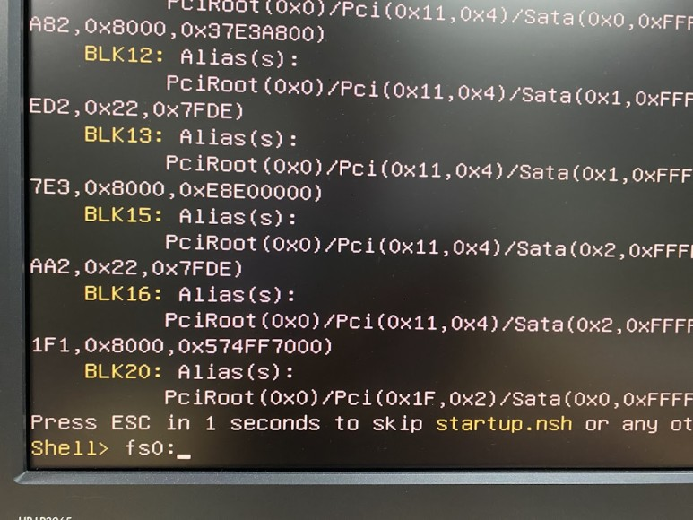
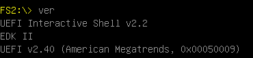
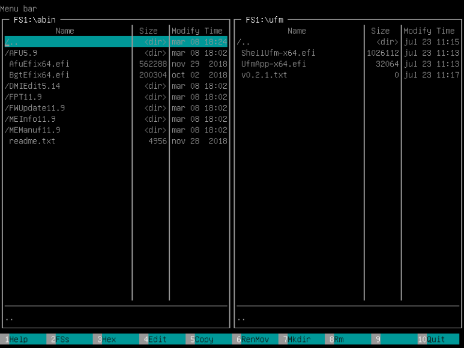
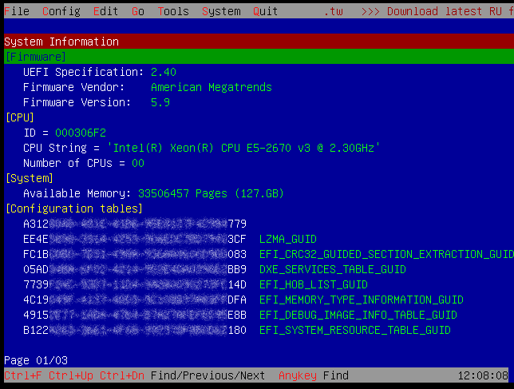
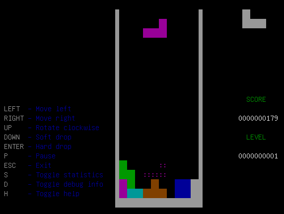
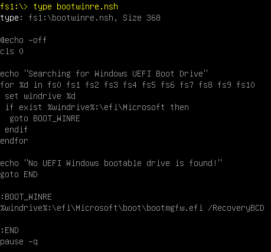
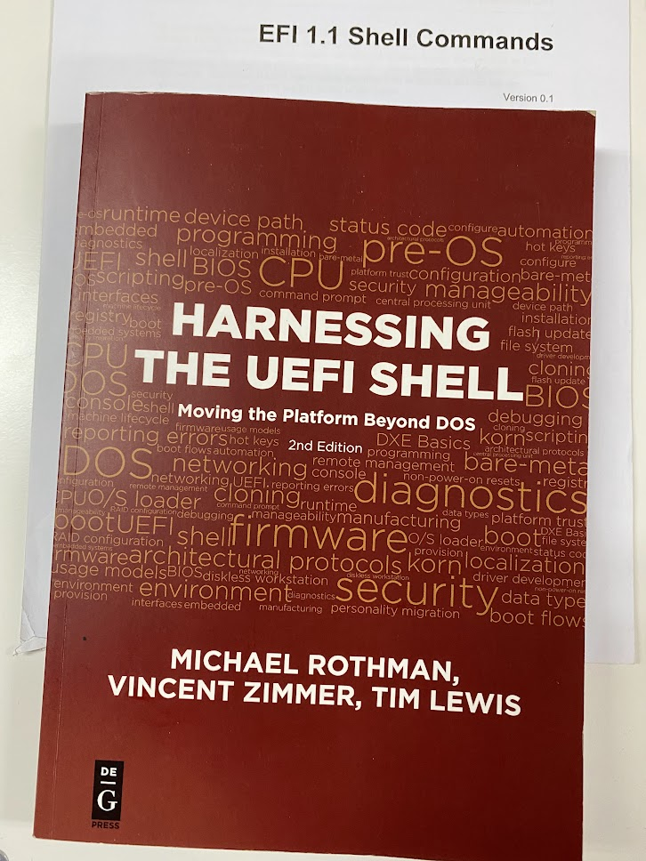

# UEFI 쉘를 DOS 처럼 사용하기 2부

> ◈ References
>
>  -  [UEFI 쉘를 DOS 처럼 사용하기 2부](https://blog.naver.com/deelab24/222875235588)
> 
> 

이전 글에 이어 본격적으로 쉘을 사용해 보기로 합니다.

EFI 쉘과 UEFI 쉘은 호환성이 있습니다. 여기서는 둘을 따로 구분하지 않고 사용할 예정입니다.

**UEFI Shell 얻기**

Shell은 앞서 소개한 TianoCore 싸이트에서 UDK/EDK II를 다운로드 받아 직접 빌드하여도 되지만...

사전에 빌드된 ShellBinPkg를 그냥 가져오면 됩니다.

[udk/ShellBinPkg at udk2015 · tianocore/udk · GitHub](https://github.com/tianocore/udk/tree/udk2015/ShellBinPkg)

조금만 더 신경쓰시면 여기 저기 바이너리(컴파일된 실행 파일)가 널려 있다는 것을 알게 됩니다.

하지만 소스가 공개되어 있어 출처가 불분명한 쉘은 사용하지 마세요.(보안 문제)

UEFI 바이너리는 .efi로 되어 있으며 .exe 파일처럼 UEFI 펌웨어 상에서 실행이 가능합니다.

**UEFI Shell로 부팅하기**

쉘로 부팅 방법도,

바이오스에 따라서는 Shell이 내장(Build-in)된 경우도 있고, 바이너리 파일를 직접 실행하는 매뉴가 있는 경우도 있습니다.

여기서는 인텔 플랫폼에서 USB로 만들어 부팅하는 방법을 소개합니다.

1. 먼저 적당한 용량의 USB 플래시 메모리를 FAT32로 포맷합니다.
2. 위의 GitHub 싸이트에서

​    tianocore/udk/ShellBinPkg/UefiShell/X64/Shell.efi를 다운로드 받아 

​    USB에 efi/boot/bootx64.efi 로 저장(이름 변경)합니다.

3. USB를 포트에 연결하고 부트 매뉴를 뛰우고 해당 USB로 부팅합니다.

​    부트 매뉴 키는 시스템 마다 다르고

​    Secure Boot가 Disable 되어 있어야 합니다.

​    이전 글을 참조해 주세요.

​    https://blog.naver.com/deelab24/222793940769

4. UEFI Shell이 실행됩니다.  

**UEFI Shell 내장 명령어**

쉘이 실행되면 먼저 파일 시스템을 선택해야 합니다.

CMD 창은 C:이 기본이지만, UFEI  쉘은 드라이브 맵만 보여 주고는 기본 파일 시스템이 선택되지 않습니다.

Shell> fs1:

프롬프트가 fs1:\>로 바뀝니다.

시스템 마다 다르지만 보통은 fs0:에 ESP(uEFI System Partition) 파티션이 fs1:에 부팅된 USB 드라이브가 선택됩니다.

명령어는 Linux C shell을 기반으로 DOS를 섞은 듯한 기분입니다.

ls와 dir이 모두 동작합니다.

통상은 FAT 파일 시스템 이외에는 드라이브 내용을 볼 수는 없습니다.

UEFI가 기본적으로 FAT만을 지원하도록 되어 있어서 입니다.

하지만 아래 싸이트에서 여러 파일 시스템 드라이버를 다운 받으실 수 있습니다.

[Free Software EFI Drivers (akeo.ie)](https://efi.akeo.ie/)

NTFS 드라이버를 다운로드 받아서

\>load ntfs_x64.efi

\>map -r

이제 NTFS로 된 C: 드라이브의 내용도 살펴볼 수 있겠네요.

여기에는 읽기 전용 드라이버들로, NTFS용 읽기/쓰기가 가능한 드라이버는 아래에서 다운 받으세요.

[Releases · pbatard/ntfs-3g · GitHub](https://github.com/pbatard/ntfs-3g/releases)

기본 명령어 몇가지 알아 볼까요.

  ls (or dir): 폴더 내용 보기. 

  cd: 디렉토리 변경. 

  cp: 파일/디렉토리 복사. 

  move: 파일/디렉토리 이동. 

  rm: 파일/디렉토리 삭제. 

  map –r: 드라이브 목록 갱신. 

  fs<#>:: 드라이브 변경

  edit: 내장 텍스트 에디터. 

  set: EFI 환경 변수 보기 (set), 설정 (set sname value), 삭제 (set –d), 또는 변경

  cls: 화면 지우기. 

  echo: 화면 출력. 

  help: 도움말. 

  exit: 쉘 종료 (바이오스 유틸리티로 돌아감). 

  ver: 버전 보기

  reset: 시스템 재시작 혹은 셧다운.

**UEFI 앱(?) 실행하기**

뿐 만 아니라 efi 바이너리(PE32 포맷의 실행 파일, .efi)들도 조금씩 개발되고 있습니다.

특히 펌웨어 업데이트 같은 저수준의 작업은 OS의 구속없이 가능하기 때문에 과거 DOS 도구를 빠르게 대치하고 있습니다.

앱 몇 가지 소개합니다.

저는 USB에 bin 폴더(위치는 상관없습니다)에 efi 실행 파일들을 모아 놓습니다.

AMI AFU(AMI Firmware Update Utility)

https://www.ami.com/resources/support-other/

BIOS가 UEFI로 바뀌면서 AMI(American Megatrends International LLC)의 Aptio는 사실상 독점이라고 해야 하나요. 아래 FPT와 함께 양대 BIOS 업데이트 도구 입니다.

다운로드 받으시면 efi 버전도 있습니다. 사용법은 차이가 없습니다.

Intel FPT(Flash Programming Tool)

EFI 를 개발한 인텔답게 SPI 플래시 도구로 모든 영역을 프로그래밍할 수 있습니다.

툴은 OEM 제조사에만 공급하지만 구하는 데는 어려움이 없습니다.

efi 버전을 사용하시면 됩니다.

UFM(UEFI File Manager)

DOS의 MDir을 연상케 하는 파일 매니저 입니다.

다운로드: [ufm - A file manager for UEFI Shell environment (joursoir.net)](http://git.joursoir.net/ufm/about/)

RU(Read Universal)

컴퓨터 하드웨어와 관련된 여러 정보들을 읽을 수 있는 도구인 RW(ReadWriteEverything)과 유사한 도구로 DOS 버전을 거쳐 efi 버전도 개발되었습니다.

다운로드: [RU.EXE + RU.EFI: 2007 (ruexe.blogspot.com)](http://ruexe.blogspot.com/2007/)

Tetris

  

다운로드: [GitHub - a1ive/uefi-tetris: Tetris for UEFI](https://github.com/a1ive/uefi-tetris)

아! Doom UEFI 버전은 코어부트(Coreboot) 커스텀 펌웨어 상에서 동작하는 거였네요.

**UEFI Script**

C Shell이나 DOS와 마찬가지로 Batch 작업을 위한 Script의 작성도 가능합니다.

파일은 .nsh 확장자를 가집니다.

그 중 루트 디렉토리의 startup.nsh는 shell이 시작하면서 자동으로 실행되는 스크립트입니다.

OEM 밴더에서 자동 펌업등에 많이 활용하고 있죠.

**Windows RE로 부팅하기**

Windows RE(Windows Recovery Environment, 윈도우 복구를 위한 작은 OS)는 특별한 Window PE(Windows Preinstallation Environment, 윈도우 설치/유지보수를 위한 작은 OS) 버전입니다.

윈도우 10은 부팅 중에는 바로 Windows RE로 넘어가지 못합니다.

종료시 RE로 종료되는 옵션(Shift+다시 시작)도 있고, 3번 이상 비정상적인 부팅이 있으면 저절로 RE로 부팅되기는 합니다.

F8 부트 옵션도 없어서 답답할 때가 있죠.

이 때 UEFI Shell로 부팅한 후, 

\efi\Microsoft 폴더가 있는 드라이브(부트 디스크의 ESP 파티션)를 찿습니다.

드라이브가 많으면 조금 지루해요.

fs0: 이라면, 이렇게 명령어를 줍니다.

fs0:\efi\Microsoft\boot\bootmgfw.efi /RecoveryBCD

(부트로더를 Recovery 모드로 부팅) ... Windows RE가 부팅됩니다.

조금 노력하시면 몇 줄의 배치 스크립트를 작성하실 수 있습니다.

이름은 boowinre.nsh가 좋겠네요.

이제는 DOS도 떠나 보낼 때가 된 것 같습니다.

**참고**

UEFI 쉘 프로그래밍에 관심이 있으시면 Michael Rothman의 책

Harnessing the Uefi Shell: Moving The Platform Beyond Dos를 적극 권해드립니다.

https://www.amazon.com/Harnessing-UEFI-Shell-Moving-Platform/dp/1501514806

